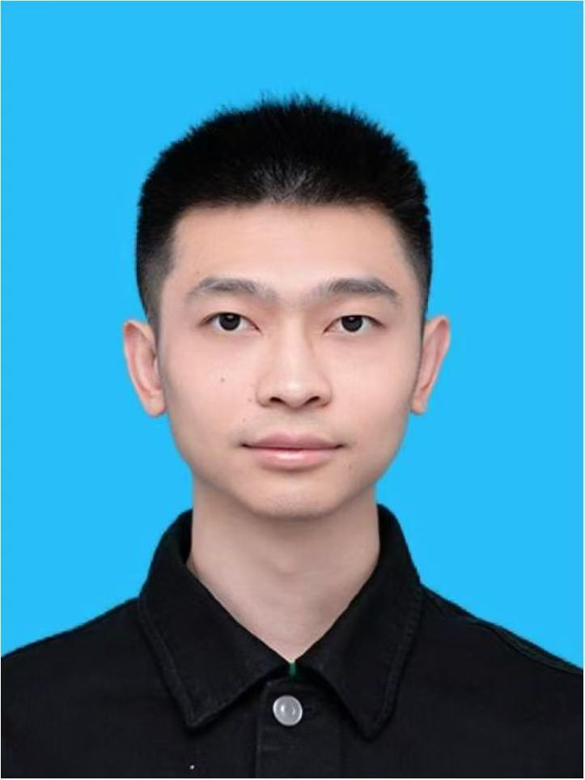

## Current

  <!-- Adds space between "Current" and "Postdocs" -->

<strong>Postdocs</strong>

  
  

    <strong>Yizhou Liang</strong> 
    PhD: Peking University 
    Research: dynamo problem, finite element complexes
  

  
  

    <strong>Ganghui Zhang</strong> 
    PhD: Tsinghua University 
    Research: numerical geometric flows, geometric PDEs
  

---

## Previous

### Postdocs

- [Marien Hanot](https://marienhanot.fr)