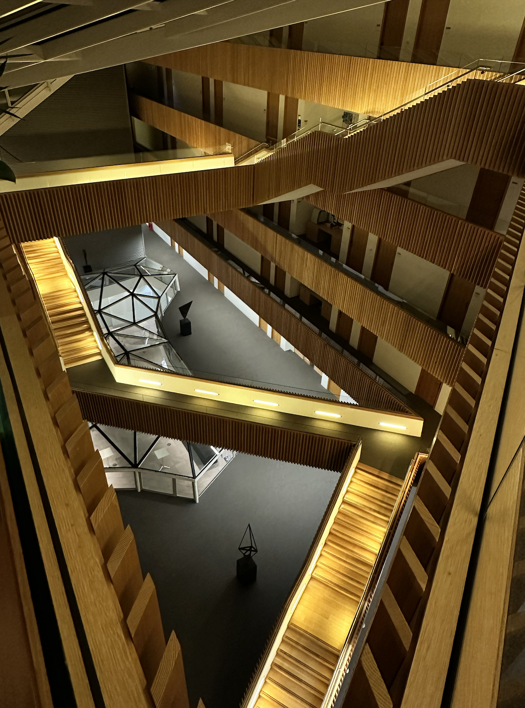

''[If an atom or electron is a basic unit for physicists, his unit is the tetrahedron.](https://www.maths.ox.ac.uk/node/61184)'' 

 

I was fascinated by the exhibition ''[Cascading Principles](https://www.maths.ox.ac.uk/node/61184)'' at the Andrew Wiles Building in Oxford by the artist [Conrad Shawcross](https://conradshawcross.com/). The spirit, as I see it, explains a lot of my passion for the part of mathematics I do. 

Finite element methods use tetrahedra (and other shapes) to approximate continua and solve equations on them. Tetrahedra, or more generally, simplices, are the source of many magics. The Whitney forms extend discrete topology encoded in simplices (chains) to everywhere defined fields; the Regge finite element extends discrete metric (edge lengths) and discrete curvature (angle deficit) to piecewise flat metric and curvature measures. This filling-in process is responsible for finite elements as a clear and rigorous method compared to many intuitive lattice-based methods. The extension is based on the concept of unisolvency: degrees of freedom (discrete physical, topological and geometric quantities) uniquely determine local shape functions (modes used for approximating a continuous field). The unisolvency of Whitney forms and Regge elements are examples of elegance and magic to me (and they are included in finite element packages and are useful as well).  

Continuous and discrete are a central topic of mathematics. Newton and Leibniz invented calculus, which brought in the concepts of infinitesimal and limits (although the rigorous definitions used nowadays came later).  In the era of computers, discrete mathematics and discrete physics draw attention (another motivation is from quantum theories). Discretization becomes a keyword for numerical PDEs: we want to discretize the governing equations of many physical (chemical, biological...) processes and mimic the continuous structures (structure-preservation). In parallel, another tradition aims at establishing discrete models and theories as first principles in the discrete world. The building blocks are tetrahedra. 
As a numerical analyst, I feel lucky and passionate to work at this interface of continuous and discrete.  To my understanding, it showcases a similar passion from an artist's point of view. 
 

  

  <figure>
    
    </figure>
  

  

    
  

  

    
  

  

    
  

  

    
  

  

    
  

 
Another reason for my fondness for the Andrew Wiles Building, in addition to the Escher-inspired stairs, is the 'crystals', from which one can glimpse the lively teaching and conference area downstairs.  The crystals in the south wing demonstrate a surface plot of the first eigenfunction of the two dimensional Laplacian (probably a finite element solution). I took a picture of these crystals on a quiet night during Covid and often used it to visualize Regge elements (piecewise flat manifolds) in my slides. 
 

<figure>
  
</figure>
 
<figure>
  
</figure>
  
Reference: [Andrew Wiles Building](https://www.maths.ox.ac.uk/system/files/attachments/OxfordMathematics_ROQ_leaflet.pdf)
