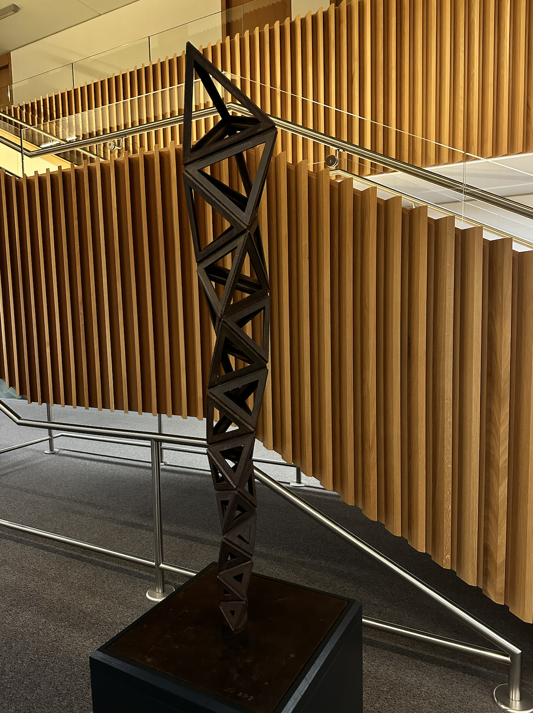
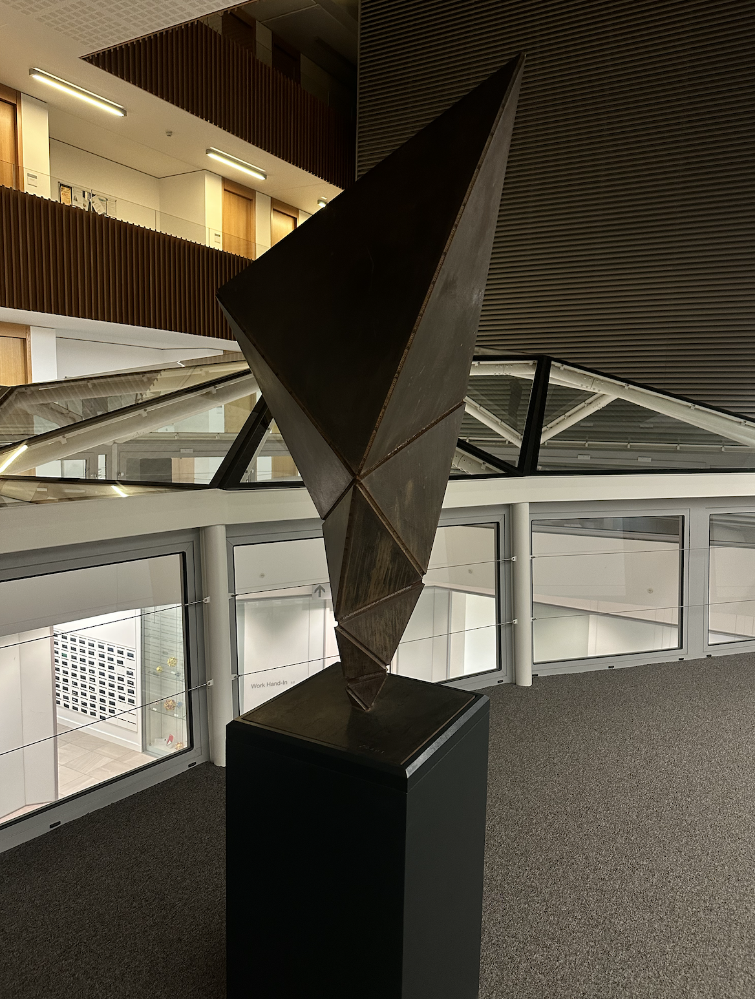

- [Some Books](#some-books)
- [Cascading Principles](#cascading-principles)

### Some Books

Here are some books that are special to me — those that have shaped my taste or inspired research questions and ideas.

I am always drawn to new questions, but dynamics, geometry, mechanics and physics, and the interplay between continuous and discrete remain consistently at the heart of my mathematical interests.  

  
  
  
    

  
  
  

<!-- 你稍后提供具体内容，例如书单、推荐理由等，可以放在这里。
例如：

Here are some books that have deeply influenced my thinking in numerical analysis, geometry, and the continuous-discrete interplay:

- **Title** by Author — brief reason why it matters to me.
- ...

-->

### Cascading Principles

> “If an atom or electron is a basic unit for physicists, his unit is the tetrahedron.”  
> — [Cascading Principles exhibition page](https://www.maths.ox.ac.uk/node/61184)

I was deeply fascinated by Conrad Shawcross's exhibition *[Cascading Principles: Expansions within Geometry, Philosophy, and Interference](https://www.maths.ox.ac.uk/node/61184)* at the Andrew Wiles Building, Oxford. (The exhibition, featuring over 40 mathematically inspired works, has been extended and remains on view until June 2026.)

The tetrahedron lies at the heart of the artist's vision — and, strikingly, it resonates strongly with my own work in finite element methods.

Tetrahedra (and simplices more generally) serve as fundamental building blocks in discretizing continuous problems. In finite element methods, we approximate continua using tetrahedral meshes to solve PDEs. Whitney forms elegantly extend discrete topological chains to well-defined differential forms, while Regge calculus discretizes metrics via edge lengths and curvatures via angle deficits, yielding piecewise-flat approximations that are mathematically rigorous.

What captivates me is the **unisolvency** principle: a carefully chosen set of discrete degrees of freedom uniquely determines the local shape functions. This “filling in” from discrete data to continuous fields is what distinguishes rigorous finite element methods from more heuristic lattice approaches. To me, the unisolvency in Whitney elements and Regge elements embodies real mathematical elegance — and happily, they are implemented in many standard FEM libraries and see practical use.

The interplay between the continuous and the discrete has long been central to mathematics — from the invention of calculus by Newton and Leibniz, through the rigorization via limits, to modern discrete-first approaches in numerical PDEs, geometric computing, and even some foundations of physics.

As a numerical analyst working at this interface, I feel fortunate to engage with questions that echo the same curiosity I see in Shawcross’s sculptures.

  

    <figure>
      
    </figure>
  

  

    
  

  

    
  

  

    
  

  

    
  

  

    
  

Another reason the Andrew Wiles Building holds special meaning for me — beyond its famous Escher-like staircase — is the “crystals” in the south wing. These glass panels display a surface plot of (likely) the first eigenfunction of the 2D Laplacian, probably computed via finite elements. I photographed them on a quiet night during the pandemic and have often used this image in talks to evoke piecewise-flat manifolds and Regge elements.

<figure>
  
  <figcaption>South wing crystals — a visualization of eigenfunctions and piecewise-flat geometry.</figcaption>
</figure>

<figure>
  
  <figcaption>The mesmerizing staircase in the Andrew Wiles Building.</figcaption>
</figure>

**Reference**  
[Andrew Wiles Building leaflet](https://www.maths.ox.ac.uk/system/files/attachments/OxfordMathematics_ROQ_leaflet.pdf)  
[Exhibition main page (extended to June 2026)](https://www.maths.ox.ac.uk/node/61184)

<!-- 未来可以继续加其他 section -->