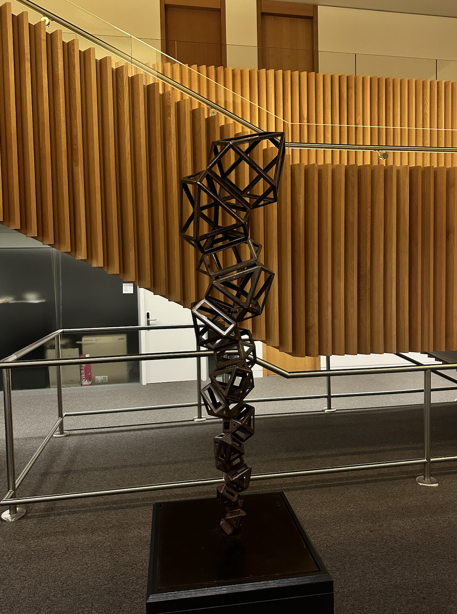
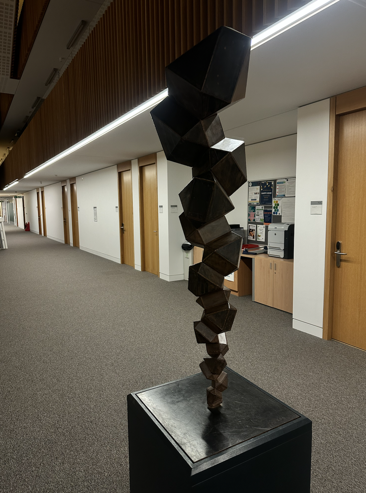
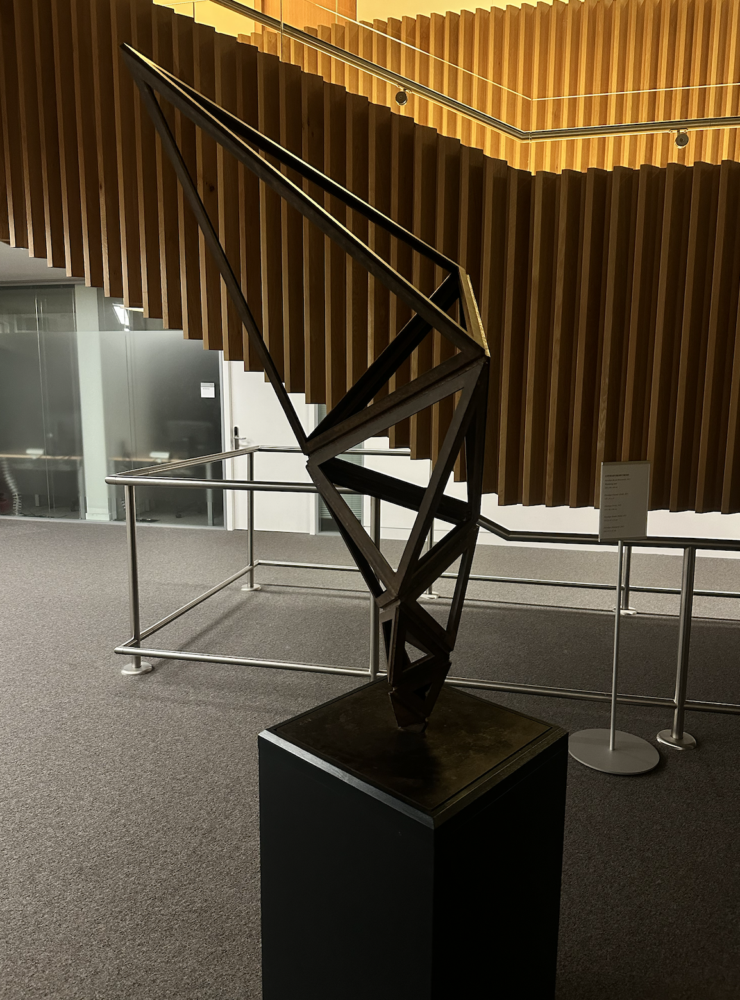

''[If an atom or electron is a basic unit for physicists, his unit is the tetrahedron.](https://www.maths.ox.ac.uk/node/61184)'' 

 

I was fascinated by the exhibition ''[Cascading Principles](https://www.maths.ox.ac.uk/node/61184)'' at the Andrew Wiles Building in Oxford by the artist [Conrad Shawcross](https://conradshawcross.com/). The spirit, as I see it, explains a lot of my passion for the part of mathematics I do. 

Finite element methods use tetrahedra (and other shapes) to approximate continua and solve equations on them. Tetrahedra, or more generally, simplices, are the source of many magics. The Whitney forms extend discrete topology encoded in simplices (chains) to everywhere defined fields; the Regge finite element extends discrete metric (edge lengths) and discrete curvature (angle deficit) to piecewise flat metric and curvature measures. This process of "filling in" is what makes finite elements rigorous, compared to more intuitive lattice-based methods. The key lies in the concept of unisolvency: degrees of freedom (discrete physical, topological, or geometric quantities) uniquely determine local shape functions (modes for approximating continuous fields). The unisolvency of Whitney forms and Regge elements, to me, demonstrates elegance and magic (and they are included in standard finite element packages and useful as well).  

The interplay between the continuous and the discrete is central to mathematics. Newton and Leibniz invented (discovered) calculus, introducing the notions of infinitesimals and limits (though the rigorous definitions we use today came later).  In the computer age, discrete mathematics and physics have gained more attention, partly due to developments in quantum theory. In numerical PDEs, discretization is a key concept: we discretize the governing equations of physical processes (whether in physics, chemistry, or biology) while attempting to preserve their continuous structure. Meanwhile, another tradition focuses on establishing discrete models and theories as first principles in the discrete world. And once again, the building blocks are often tetrahedra.

As a numerical analyst, I feel lucky and passionate to work at this interface of continuous and discrete.  To me, this work reflects a similar passion that I see from the artist's perspective.
 
<head>

</head>

  

  <figure>
    
    </figure>
  

  

    
  

  

    
  

  

    
  

  

    
  

  

    
  

 
Another reason I feel a special fondness for the Andrew Wiles Building, apart from its Escher-inspired staircase, is the presence of the "crystals." From these, one can glimpse the lively teaching and conference areas downstairs. The crystals in the south wing depict a surface plot of the first eigenfunction of the two-dimensional Laplacian (probably a finite element solution). I took a picture of these crystals on a quiet night during the COVID lockdown and often use it to visualize Regge elements (piecewise-flat manifolds) in my presentations.
 

<figure>
  
</figure>
 
<figure>
  
</figure>
  
Reference: [Andrew Wiles Building](https://www.maths.ox.ac.uk/system/files/attachments/OxfordMathematics_ROQ_leaflet.pdf)
